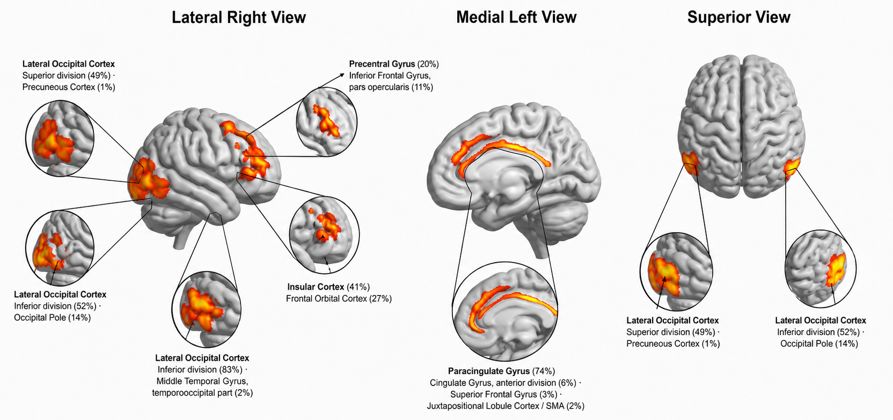
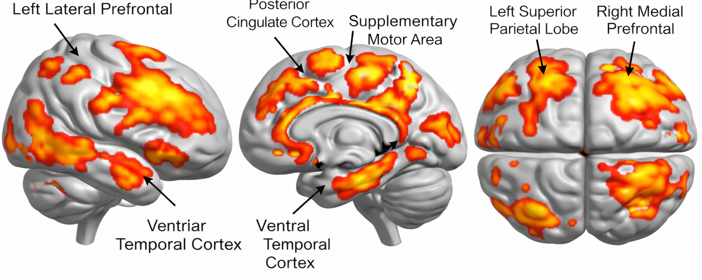
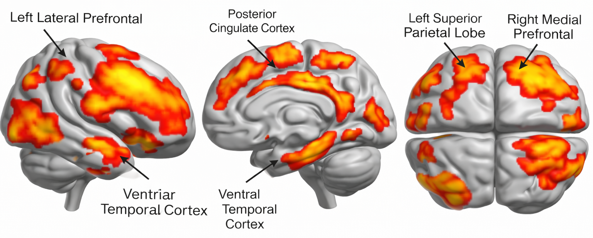
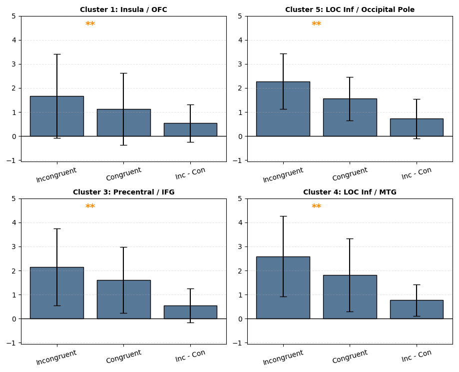

<div align="center">

#  fMRI Flanker Task Analysis

[](https://fsl.fmrib.ox.ac.uk/)
[](https://www.python.org/)
[](https://www.gnu.org/software/bash/)
[](#)
<br/>

> **A complete neuroimaging pipeline for analyzing cognitive control mechanisms during the Eriksen Flanker Task using FSL FEAT — from raw fMRI data to group-level statistical brain maps.**

<br/>



*Group-level brain activation maps: Incongruent (left) vs. Congruent (right) contrast*

</div>

---


##  Overview

This project implements a **full three-level fMRI analysis pipeline** for the **Eriksen Flanker Task**, a classic paradigm used to probe **cognitive control**, **response inhibition**, and **conflict monitoring** in the human brain.


##  Task Design

The **Eriksen Flanker Task** requires participants to respond to a central arrow while ignoring flanking arrows that either point in the **same (congruent)** or **opposite (incongruent)** direction.

```
Congruent:    ← ← ← ← ←      (easy — no conflict)
Incongruent:  → → ← → →      (hard — response conflict)
```

The **Incongruent > Congruent** contrast isolates brain regions involved in **conflict detection and executive control**, particularly the anterior cingulate cortex (ACC) and lateral prefrontal cortex.

---

##  Analysis Pipeline

```
Raw fMRI Data (BIDS Format)
        │
        ▼
┌────────────────────────────────────┐
│   1st Level Analysis (per run)     │
│   • Skull stripping (BET/bet2)     │
│   • Motion correction              │
│   • Temporal filtering             │
│   • GLM with HRF convolution       │
│   • Contrasts: Con / Incon / Diff  │
└────────────────┬───────────────────┘
                 │  (26 subjects × 2 runs)
                 ▼
┌────────────────────────────────────┐
│   2nd Level Analysis (per subject) │
│   • Fixed-effects across runs      │
│   • Within-subject averaging       │
│   • cope1, cope2, cope3            │
└────────────────┬───────────────────┘
                 │  (26 subjects)
                 ▼
┌────────────────────────────────────┐
│   3rd Level Analysis (group)       │
│   • Mixed-effects (FLAME 1)        │
│   • Whole-brain Z-maps             │
│   • Cluster-based thresholding     │
└────────────────┬───────────────────┘
                 │
                 ▼
┌────────────────────────────────────┐
│   ROI Analyses                     │
│   • dmPFC (Jahn sphere)            │
│   • Paracingulate Gyrus            │
│   • 6 cluster regions              │
│   • Bonferroni correction          │
└────────────────────────────────────┘
```


## 📊 Key Results

### Whole-Brain Group Activation

<div align="center">



*Left: Congruent | Right: Incongruent — group-level Z-stat maps (Z > 3.1, cluster p < 0.05)*
</div>

<br/>

### Cluster Activation Comparison

<div align="center">


*Comparison of mean activation across identified clusters (Congruent vs. Incongruent vs. Difference)*
</div>

<br/>


##  Materials

-  Research Paper: [`FMRI Paper.pdf`](Report%20and%20Paper/FMRI%20Paper.pdf)
-  Full Report: [`FMRI Rerport.pdf`](Report%20and%20Paper/FMRI%20Rerport.pdf)
---
